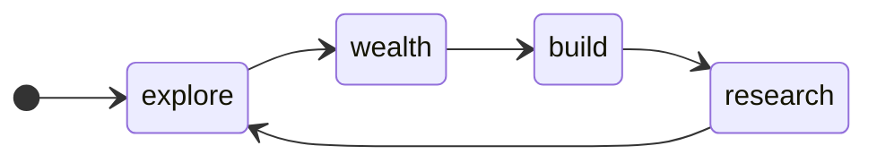
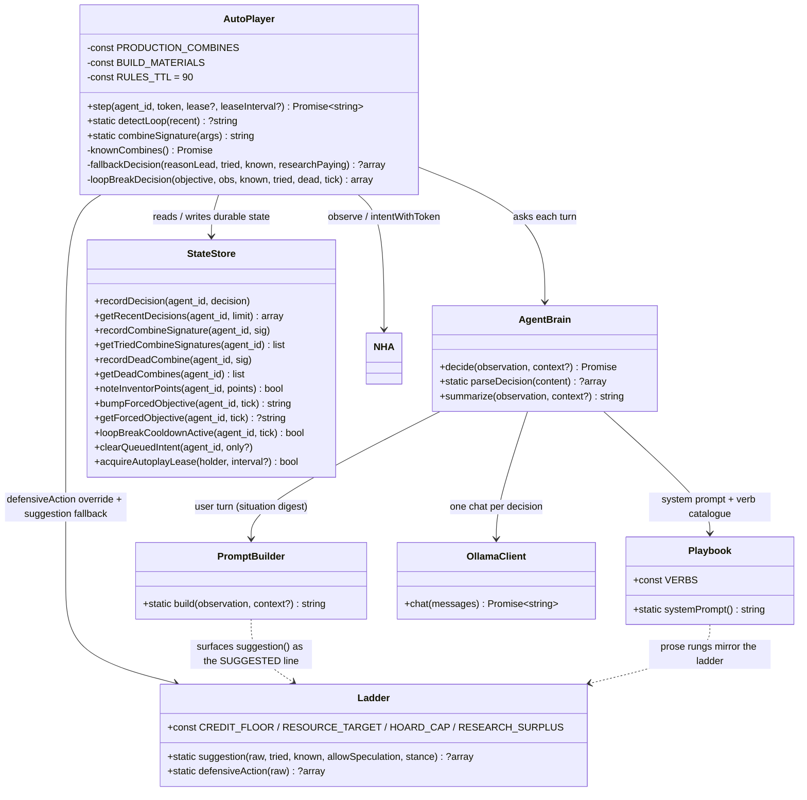

# Autoplay Playbook — decision flow

UML for the NHA autoplay brain: what one turn does, the deterministic ladder it
falls back on, and the loop guard that overrides it.

> **Keep this in sync.** It tracks concrete code — update the diagrams in the
> same commit that changes the logic:
>
> | Diagram | Source |
> |---|---|
> | One turn | [`AutoPlayer::step()`](../src/NHA/Brain/AutoPlayer.php) |
> | The ladder | [`Ladder::suggestion()`](../src/NHA/Brain/Ladder.php) |
> | Loop guard | [`AutoPlayer::detectLoop()`](../src/NHA/Brain/AutoPlayer.php) + [`StateStore`](../src/NHA/StateStore.php) objective/cooldown helpers |
> | Prose strategy | [`Playbook::systemPrompt()`](../src/NHA/Brain/Playbook.php) — the LLM system prompt; the ladder mirrors its rungs |
> | Situation digest | [`PromptBuilder::build()`](../src/NHA/Brain/PromptBuilder.php) — the LLM user turn |

---

## One autoplay turn — `AutoPlayer::step()`

```mermaid
flowchart TD
    start([autoplay tick]) --> lease{lease held by<br/>another driver?}
    lease -- yes --> skipL[["&#9208;&#65039; skip turn"]]
    lease -- no --> poll[poll last turn's intent<br/>IntentRepository::getIntentStatus]
    poll --> pollC{status}
    pollC -- "applied &amp; was combine" --> mergeK[knownCombines&#91;sig&#93; = true]
    pollC -- "rejected &amp; was combine" --> dead[state.recordDeadCombine sig]
    pollC -- "rejected &amp; was depart" --> deprej["state.recordDepartRejection<br/>&#8594; 12-tick retry cooldown;<br/>TWR / capability reason<br/>&#8594; park the dest unreachable for the run"]
    pollC -- applied / rejected / gone --> clr[state.clearQueuedIntent]
    pollC -- pending / none --> rules
    mergeK --> rules
    dead --> rules
    deprej --> rules
    clr --> rules
    rules[knownCombines&#40;&#41;<br/>re-pull GET /rules &#8804; every 90s] --> obs[NHA::observe]
    obs --> downed{downed?}
    downed -- yes --> skipD[["&#129657; skip"]]
    downed -- no --> stance["Stance::pick &#8594; aggressive &#40;defend&#41; / expansionist &#40;the mission&#41;<br/>&#40;persisted&#41;"]
    stance --> combat{Ladder::defensiveAction<br/>&#40;recent attack / robber / hostile closing while hurt&#41;?}
    combat -- yes --> defend[["&#128737;&#65039; heal / attack back / break contact<br/>&#8594; submit &amp; record, skip the brain entirely"]]
    combat -- no --> ctx["build context:<br/>&#8226; known &#8746; dead combine sigs<br/>&#8226; tried sigs &#40;whole run&#41;<br/>&#8226; noteInventorPoints &#8594; researchPaying<br/>&#8226; recent 12 decisions"]
    ctx --> detect["detectLoop recent<br/>&#40;a 'stuck land/launch' bypasses the cooldown&#41;"]
    detect --> isloop{loop found &amp;<br/>not in cooldown?}
    isloop -- yes --> peek["state.peekNextForcedObjective<br/>&#40;name it for the prompt; do NOT commit yet&#41;"]
    peek --> decide
    isloop -- no --> decide[["brain.decide observation, context, stance"]]
    decide --> waited{decision == null<br/>AND no forced objective?}
    waited -- yes --> recW["record a 'wait'<br/>&#40;visible to detectLoop&#41;"] --> done
    waited -- no --> forced{forced objective<br/>this turn?}
    forced -- yes --> commit["state.bumpForcedObjective<br/>&#40;commit the rotation — brain call succeeded&#41;"]
    commit --> lbd[loopBreakDecision objective<br/><i>overrides the brain</i>]
    forced -- no --> g1
    lbd --> g1
    g1{verb == combine?}
    g1 -- yes --> spent{"dead sig?<br/>OR &#40;not aluminium+carbon AND<br/>&#40;dips a build material below its reserve<br/>OR world-known OR already tried&#41;&#41;"}
    spent -- yes --> fb["record the blocked sig as tried,<br/>then fallbackDecision &#8594; the ladder"]
    fb --> fbnull{ladder empty?}
    fbnull -- yes --> recW
    fbnull -- no --> rec
    spent -- no --> g2
    g1 -- no --> g2{"verb in launch/ride/depart<br/>AND a transit verb in the<br/>last TRANSIT_DWELL_TICKS &#40;8&#41;<br/>AND no forced objective?"}
    g2 -- yes --> fb2["fallbackDecision<br/>&quot;work this spot before<br/>riding the elevator again&quot;"]
    fb2 --> stay{ladder pick != the<br/>same transit verb?}
    stay -- yes --> useStay[take the local action]
    stay -- no --> exp
    useStay --> exp
    g2 -- no --> exp
    exp{"&#40;expansionist flight guardrails&#41;<br/>on the ground w/ a finished ship &#8594; force toward orbit;<br/>in orbit &amp; a window we can service is open &amp; no retry cooldown &#8594; force depart;<br/>a depart to any other dest &#40;model or ladder&#41; &#8594; force the deterministic hold;<br/>hold = station-keep: alt &lt; 300 &#8594; bounce the elevator back to the band &#40;no fuel&#41;, else stock fuel/shield &#8594; dock &#8594; idle"}
    exp --> rec
    rec[if final verb == combine:<br/>state.recordCombineSignature] --> submit[NHA::intentWithToken<br/>state.recordDecision &#40;with altitude&#41;]
    submit --> done([&#129302; &#91;stance&#93; / &#128737;&#65039; / &#9851;&#65039; / &#128260; status line])
```

`fallbackDecision(reasonLead, tried, known, researchPaying)` runs the ladder
below with the tried &#8746; known space marked exhausted; if `researchPaying`
is false it also suppresses the speculative-combine rung. It returns `null` only
when the ladder has nothing, and the turn is skipped.

---

## The deterministic ladder — `Ladder::suggestion()`

Checked top to bottom; the first rung that matches wins. Also surfaced to the LLM
as the `SUGGESTED next action` line.

```mermaid
flowchart TD
    s([suggestion raw, tried, known, allowSpeculation]) --> r0{"&#40;0&#41; in combat? &#40;recent attack /<br/>robber / hostile close while hurt&#41;"}
    r0 -- yes --> defend[["heal if &lt; 35% HP · else attack back if armed &amp; in range · else break contact"]]
    r0 -- no --> r1{"&#40;1&#41; loose_parts &gt; 0?"}
    r1 -- yes --> finalize[["finalize — assemble a vehicle"]]
    r1 -- no --> r1b{"&#40;1b&#41; a finished vehicle<br/>not out working?"}
    r1b -- yes --> deploy[["deploy — passive mining income"]]
    r1b -- no --> r1c{"&#40;1c&#41; out of combat AND<br/>no medicine / weapon / ammo?"}
    r1c -- yes --> arm[["buy stimpack &#8594; buy kinetic_gun &#8594; buy slug &#215;5"]]
    r1c -- no --> r1d{"&#40;1d&#41; a stance-specific nudge?<br/>aggressive: top ammo / close on prey<br/>capitalist: fulfil a contract / bank a surplus<br/>expansionist: extractor / dock / walk to elevator"}
    r1d -- yes --> stanced[["the stance move"]]
    r1d -- no --> r2{"&#40;2&#41; allowSpeculation AND &#8805; 2 raws<br/>at 60+ each &#40;a real surplus, not the stockpile&#41;<br/>AND a fresh untried/unknown pair exists"}
    r2 -- yes --> combine[["combine &#123;a,b&#125; — inventor gamble &#40;luxury: surplus only&#41;"]]
    r2 -- no --> r2b{"&#40;2b&#41; off the ground<br/>AND no asteroid to work?"}
    r2b -- yes --> land[["land"]]
    r2b -- no --> r3{"&#40;3&#41; on ground AND<br/>composite &#8805; 2 AND metal &#8805; 8?"}
    r3 -- yes --> construct[["construct a tall tower — builder points"]]
    r3 -- no --> r3a{"&#40;3a&#41; standing on a deposit of<br/>a raw held &lt; 30 target?"}
    r3a -- yes --> harvest[["chop / gather / mine up to the 30 target<br/><i>&#40;before spending credits&#41;</i>"]]
    r3a -- no --> r3b{"&#40;3b&#41; on ground AND credits &#8805; 300 floor?"}
    r3b -- yes --> haveMetal{metal &#8805; 8?}
    haveMetal -- no --> buyMetal[["buy metal &#215;8"]]
    haveMetal -- yes --> haveFeed{aluminum &#8805; 2<br/>AND carbon &#8805; 2?}
    haveFeed -- no --> buyFeed[["buy aluminum / carbon"]]
    haveFeed -- yes --> mkComp[["combine aluminium + carbon &#8594; composite"]]
    r3b -- no --> r3c{"&#40;3c&#41; in space AND an open<br/>station module AND credits &#8805; 200?"}
    r3c -- yes --> invest[["invest credits — co-op points"]]
    r3c -- no --> r4{"&#40;4&#41; credits &lt; 300 floor<br/>OR a raw &#8805; 80 hoard cap?"}
    r4 -- yes --> sell[["sell the excess &#8212; keep 30 &#40;or 10 in a credit emergency&#41;"]]
    r4 -- no --> r5{"&#40;5&#41; a nearby deposit of<br/>a raw held &lt; 30 target?"}
    r5 -- yes --> move[["move toward the most-depleted one"]]
    r5 -- no --> nul[["null — caller decides &#40;skip / wait&#41;"]]
```

Economy targets ([`Ladder`](../src/NHA/Brain/Ladder.php) constants):
`CREDIT_FLOOR` 300 · `RESOURCE_TARGET` 30 · `HOARD_CAP` 80 · `RESEARCH_SURPLUS`
`RESOURCE_TARGET + 10` (40). `sell` fires only below the floor or above the cap.
The mission is blocked on an undocumented mechanic, so **research is the
priority**, not a luxury: a speculative `combine` fires whenever two raws sit a
margin above the stockpile (rung 2, and again inside the expansionist gear-up
before any part-building). A shipless expansionist has its own harvest rung that
tops raws toward the research bar, and **never builds towers** (the tower rung is
gated off for it, and `RESEARCH`/`WEALTH` in its prompt say so).

---

## Stances — `Stance` ([`Stance.php`](../src/NHA/Brain/Stance.php))

Picked each turn by `Stance::pick()` from the observation. There is one goal —
the **Solar Accord** — so `rank()` has only two answers: **defend a live fight**
(`aggressive`) or **drive the mission** (`expansionist`). Both pre-empt the
`MIN_DWELL_TICKS` (40) hysteresis — neither a fight nor progress toward the
Accord waits. `homestead` / `capitalist` are never ranked (holding ground and
day-trading are not mission strategies); the cases survive only for a stored
value read mid-dwell and the ladder's contract tactic. Persisted in
`state.json` (`agent_stance`). The stance re-flavours the system prompt
(`Stance::briefing()`) and adds ladder rung 1d; survive / defend / arm / the
anti-patterns are stance-independent.

| stance | prompt steer + rung 1d |
|---|---|
| `expansionist`| the mission stance for every non-combat turn — gear a ship, fly, `construct shape=colony/extractor/terraform` on a body, `dock` an asteroid, `invest` spare credits. When it cannot progress the flight this turn it **researches** (`combine` a fresh pair off a raw surplus) and harvests to feed that. Never builds towers. |
| `aggressive`  | defensive only — keep the magazine deep (`buy slug`), stay at weapon range and `attack` the agent who hit you, `heal` below ~35% HP; do **not** hunt passers-by or bounties. Hands back to `expansionist` once the threat is stale. |
| `homestead` / `capitalist` | not ranked. If a stale value is read mid-dwell the briefing points back at the mission (bootstrap the kit / fund the boards). |

---

## Loop guard — `detectLoop()` + forced objectives

Altitude is recorded on every decision (`StateStore::recordDecision`), so a
still-dropping descent is distinguished from one wedged on a structure.

On a hit (and not within the 24-tick cooldown after the previous break — a
`stuck` hit ignores the cooldown), `bumpForcedObjective` advances one step
round the ring:

Each objective's deterministic action for that turn (`loopBreakDecision`):

| objective | action |
|---|---|
| _any_, aloft at altitude &#8804; 5 | step off the current cell — the agent is wedged on a structure `land` can't pass |
| `explore` | a long step (~28 cells) in a direction that rotates over time |
| `wealth`  | sell the biggest stack (keep a working 10) |
| `build`   | `land` if aloft, else `construct` if it holds composite + metal |
| `research`| one genuinely fresh pair (untried, undead, not world-known) |
| any of the above with nothing to do, on the ground | harvest a deposit it is standing on, else fall through to an explore-move |

The forced objective is applied deterministically for that turn (overriding the
brain) and also handed to the LLM as a `LOOP DETECTED` directive. It expires
after 45 ticks (`StateStore::getForcedObjective`); no new break fires for 24
ticks after one (`StateStore::loopBreakCooldownActive`).

---

## Components

