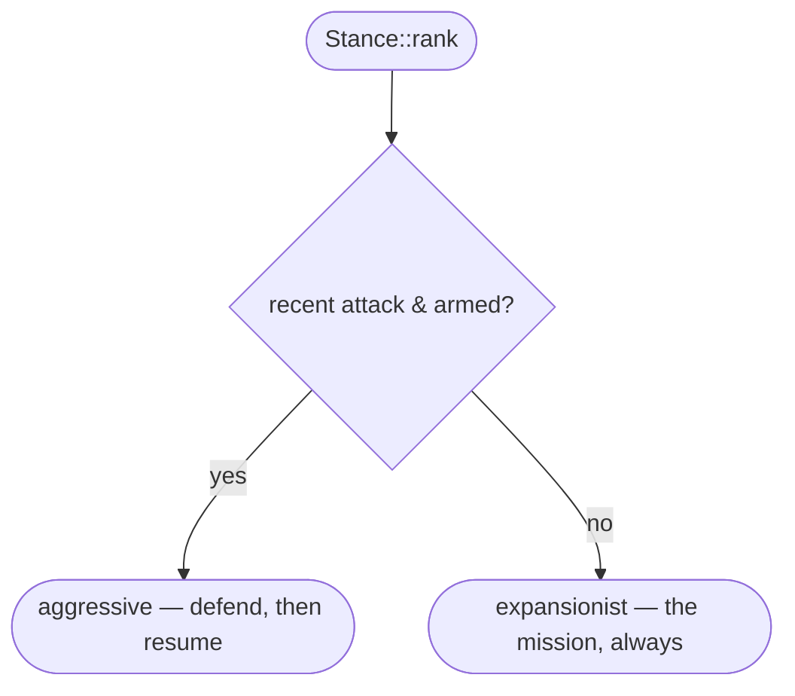
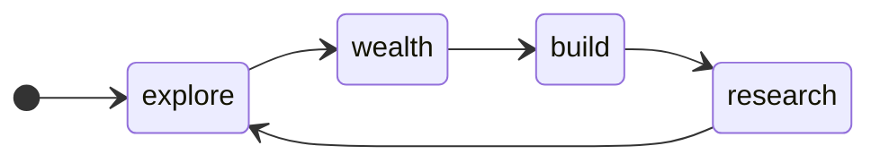
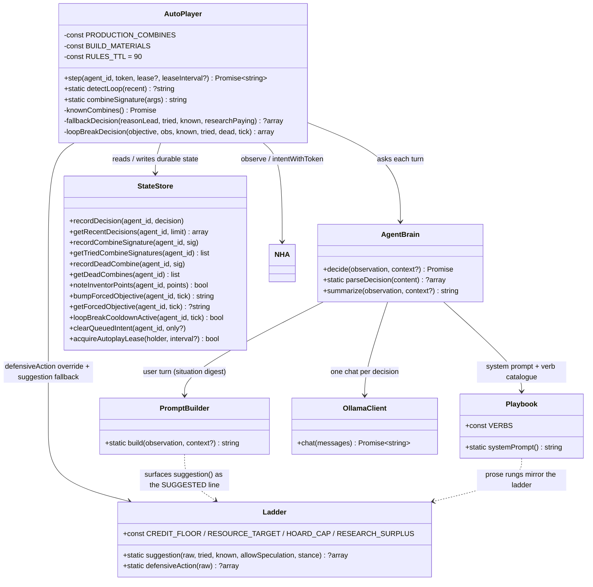

# Autoplay Playbook — decision flow

UML for the NHA autoplay brain: what one turn does, the deterministic ladder it
falls back on, and the loop guard that overrides it.

> **Keep this in sync.** It tracks concrete code — update the diagrams in the
> same commit that changes the logic:
>
> | Diagram | Source |
> |---|---|
> | One turn | [`AutoPlayer::step()`](../src/NHA/Brain/AutoPlayer.php) |
> | The ladder | [`Ladder::suggestion()`](../src/NHA/Brain/Ladder.php) |
> | Loop guard | [`AutoPlayer::detectLoop()`](../src/NHA/Brain/AutoPlayer.php) + [`StateStore`](../src/NHA/StateStore.php) objective/cooldown helpers |
> | Prose strategy | [`Playbook::systemPrompt()`](../src/NHA/Brain/Playbook.php) — the LLM system prompt; the ladder mirrors its rungs |
> | Situation digest | [`PromptBuilder::build()`](../src/NHA/Brain/PromptBuilder.php) — the LLM user turn |

---

## One autoplay turn — `AutoPlayer::step()`

```mermaid
flowchart TD
    start([autoplay tick]) --> lease{lease held by<br/>another driver?}
    lease -- yes --> skipL[["&#9208;&#65039; skip turn"]]
    lease -- no --> poll[poll last turn's intent<br/>IntentRepository::getIntentStatus]
    poll --> pollC{status}
    pollC -- "applied &amp; was combine" --> mergeK[knownCombines&#91;sig&#93; = true]
    pollC -- "rejected &amp; was combine" --> dead[state.recordDeadCombine sig]
    pollC -- "rejected &amp; was depart" --> deprej["state.recordDepartRejection<br/>&#8594; 12-tick retry cooldown;<br/>TWR / no-landing_gear reason<br/>&#8594; park the dest &#40;+ all gear bodies&#41; unreachable for the run"]
    pollC -- applied / rejected / gone --> clr[state.clearQueuedIntent]
    pollC -- pending / none --> rules
    mergeK --> rules
    dead --> rules
    deprej --> rules
    clr --> rules
    rules[knownCombines&#40;&#41;<br/>re-pull GET /rules &#8804; every 90s] --> prof["AgentRepository::getAgentInfo<br/>&#40;the world's activity feed; best-effort&#41;"]
    prof --> obs[NHA::observe]
    obs --> capfeed["reviewCapabilityFeed:<br/>fold every NEW rejected act from /agent/&#123;id&#125;.recent<br/>through RejectionClassifier &#8594; state.recordCapability<br/>&#40;needs_part / capability / needs_item / needs_enum&#41;;<br/>clear a needs_item block once its item is held;<br/>advance the review high-water tick"]
    capfeed --> colony["on a body surface &#8594; GET /colony/&#123;body&#125;<br/>&#40;best-effort; empty board otherwise&#41;"]
    colony --> downed{downed?}
    downed -- yes --> skipD[["&#129657; skip"]]
    downed -- no --> stance["Stance::pick &#8594; aggressive &#40;defend&#41; / expansionist &#40;the mission&#41;<br/>&#40;persisted&#41;"]
    stance --> combat{Ladder::defensiveAction<br/>&#40;recent attack / robber / hostile closing while hurt&#41;?}
    combat -- yes --> defend[["&#128737;&#65039; heal / attack back / break contact<br/>&#8594; submit &amp; record, skip the brain entirely"]]
    combat -- no --> ctx["build context:<br/>&#8226; known &#8746; dead combine sigs<br/>&#8226; tried sigs &#40;whole run&#41;<br/>&#8226; noteInventorPoints &#8594; researchPaying<br/>&#8226; recent 12 decisions<br/>&#8226; blocked_capabilities &#40;the ledger&#41;<br/>&#8226; departUnreachable &#8746; ledger depart:* targets"]
    ctx --> detect["detectLoop recent<br/>&#40;a 'stuck land/launch' bypasses the cooldown&#41;"]
    detect --> isloop{loop found &amp;<br/>not in cooldown?}
    isloop -- yes --> peek["state.peekNextForcedObjective<br/>&#40;name it for the prompt; do NOT commit yet&#41;"]
    peek --> decide
    isloop -- no --> decide[["brain.decide observation, context, stance"]]
    decide --> waited{decision == null<br/>AND no forced objective?}
    waited -- yes --> recW["record a 'wait'<br/>&#40;visible to detectLoop&#41;"] --> done
    waited -- no --> forced{forced objective<br/>this turn?}
    forced -- yes --> commit["state.bumpForcedObjective<br/>&#40;commit the rotation — brain call succeeded&#41;"]
    commit --> lbd[loopBreakDecision objective<br/><i>overrides the brain</i>]
    forced -- no --> g1
    lbd --> g1
    g1{verb == combine?}
    g1 -- yes --> spent{"dead sig?<br/>OR &#40;not aluminium+carbon AND<br/>&#40;dips a build material below its reserve<br/>OR world-known OR already tried&#41;&#41;"}
    spent -- yes --> fb["record the blocked sig as tried,<br/>then fallbackDecision &#8594; the ladder"]
    fb --> fbnull{ladder empty?}
    fbnull -- yes --> recW
    fbnull -- no --> rec
    spent -- no --> g2
    g1 -- no --> g2{"verb in launch/ride/depart<br/>AND a transit verb in the<br/>last TRANSIT_DWELL_TICKS &#40;8&#41;<br/>AND no forced objective?"}
    g2 -- yes --> fb2["fallbackDecision<br/>&quot;work this spot before<br/>riding the elevator again&quot;"]
    fb2 --> stay{ladder pick != the<br/>same transit verb?}
    stay -- yes --> useStay[take the local action]
    stay -- no --> exp
    useStay --> exp
    g2 -- no --> exp
    exp{"&#40;expansionist flight guardrails&#41;<br/>dead-end hull &#40;deimos + phobos + mars each depart-rejected OR already colony-done&#41; &#8594; gear a fresh flyer;<br/>on the ground w/ a depart-capable ship &#8594; force toward orbit;<br/>in orbit &amp; a window we can service is open &amp; no retry cooldown &#8594; force depart;<br/>a depart to any other dest &#40;model or ladder&#41; &#8594; force the deterministic hold;<br/>hold = station-keep: alt &lt; 300 &amp; ride cooldown elapsed &#8594; bounce the elevator back to the band &#40;no fuel, arms a 12-tick cooldown&#41;, else stock fuel/shield &#8594; dock &#8594; idle;<br/>body-surface construct the feed shows refused for materials &#8594; Ladder::bodyBuildStep &#40;buy the short depot raw / combine chips&#41;, or rewrite a bad `kind` arg;<br/>colony board has an incomplete module &#8594; Ladder::colonyFundStep &#40;hold a needed material &#8594; construct shape=colony, else Ladder::acquire it — mine a nearby deposit / dock an asteroid before buying&#41;; colony share funded &#8594; a construct extractor past the cap OR a construct shape=colony with a module not open on the board is dropped &#8594; hand off to the flight ladder &#40;ride / depart home&#41;"}
    exp --> rec
    rec[if final verb == combine:<br/>state.recordCombineSignature] --> submit[NHA::intentWithToken<br/>state.recordDecision &#40;with altitude&#41;]
    submit --> done([&#129302; &#91;stance&#93; / &#128737;&#65039; / &#9851;&#65039; / &#128260; status line])
```

`fallbackDecision(reasonLead, tried, known, researchPaying)` runs the ladder
below with the tried &#8746; known space marked exhausted; if `researchPaying`
is false it also suppresses the speculative-combine rung. It returns `null` only
when the ladder has nothing, and the turn is skipped.

**Capability ledger** (`reviewCapabilityFeed` + [`CapabilityLedgerTrait`](../src/NHA/State/CapabilityLedgerTrait.php)).
The world's `GET /agent/{id}.recent` feed lists every rejected act with its
reason — including refusals that landed between intent polls and would otherwise
be lost. Each new entry is run through
[`RejectionClassifier`](../src/NHA/Brain/RejectionClassifier.php), which drops
transient reasons (closed window, one-turn shortage) and classes the durable
ones: `needs_part` / `capability` (a hull limit — cleared on the next
`finalize`), `needs_item` (a missing consumable — cleared when it is held),
`needs_enum` (a bad enum arg — sticky for the run). A `depart:<body>` verdict
merges into `departUnreachable`, so the flight guardrails stop holding for — and
stop retrying — a hop the ship cannot make.

**Colony board** (`GET /colony/{body}` + `Ladder::colonyFundStep()`). On a body
surface the mission is to finish that body's co-op colony. The board carries
each module's `need` / `remaining` / `contrib` and a `cap_pct_per_agent`.
`colonyNextModule()` picks the first incomplete one; `colonyAgentHeadroom()` is
`min(remaining, floor(need × cap%) − own contribution)` per outstanding
material; `colonyFundStep()` then either **funds** it (`construct
{shape:colony, body, module}` consumes a held needed material) or **acquires**
the outstanding material this agent has the most room on via `Ladder::acquire()`
— which weighs LOCATION: mine a matching `nearby_deposits` entry (free) or dock
an asteroid before spending credits at the depot, and returns `null` when the
resource can't be got where the agent is. Once this agent has funded its full
per-agent share (or the colony is complete): a `construct {shape:extractor}`
past `MAX_BODY_EXTRACTORS` (3), and a `construct {shape:colony}` whose `module`
isn't an open module on the board (the model hallucinates `habitat`,
`power_grid`, …), are both dropped — the guardrail hands off to the expansionist
flight ladder to ride the elevator / depart for home. Without this the agent
churns on a finished body forever, because the observation never carries
`expansion.colony`.

"On a body's surface" is `Ladder::onBodySurface()` — `expansion.place.where ==
"body_surface"` / `location: "on_<body>"` / `at_body` set — **not**
`!in_space && altitude == 0`, which is Earth-only (a moon reports `in_space`
and a non-zero altitude on the ground). Once this agent's colony share is
funded and it is back in the body's orbit with a flight-ready fuelled ship and
the window open, the guardrail emits `depart {dest:'earth'}` — the only return
leg in the brain; the `at_body_orbit` land-force and the outbound-`depart`
sanity-check both exempt a `dest:'earth'`. `Ladder::departTarget()` (the
OUTBOUND Earth→body picker) also refuses whenever the agent is associated with
a body at all, so it can never offer "depart to the moon you're already on".

The return trip is a small state machine keyed on **altitude**, not just
`place.where` (which on a moon stays `"body_surface"` even up at the elevator
top): `alt < 550` = grounded (gear a flyer / stock `cryo_fuel` to
`return_dv+15` / ride up once the window is ≤30 ticks out); `alt ≥ 550` = in
the depart band — `depart earth` on an open window, else **hold** (never ride
back down — that was the sawtooth). Because `expansion.at_body` /
`at_body_orbit` / `location` can all glitch empty for a tick, a persistent
`StateStore` latch (`setGoingHome()` / `goingHome()` / `clearGoingHome()`) is
set the moment the share is funded and read every turn instead of
re-deriving "heading home" from those fields; it clears only once `location`
reports Earth or the agent is in transit to it.

**Visiting the whole system, not just the first reachable body.**
`Ladder::DEPART_ORDER` (`deimos, phobos, mars, venus`, cheapest Δv first) has
no notion of "already done here" — `departTarget()` just returns the first
one whose window is open and whose arrival items are held. Two things used to
cap that at "wherever the agent reached first":

  - **Venus's second item, `acid_skin`, was never craftable** (only
    `heat_shield` was packed), so `departTarget()` silently skipped Venus
    forever. `Ladder::acidSkinStep()` climbs the real chain from `GET /rules`
    (`acid_skin = acid + rubber`, `rubber = sulfur + plastic`,
    `plastic = oil + carbon`, `acid = sulfur + water` — four Earth-depot raws,
    three combines) one step per call, wired in next to the `heat_shield`
    packing (gear-up + holding for a window).
  - **A funded colony's body stayed in `DEPART_ORDER`'s rotation forever.**
    `StateStore::recordColonyDone()` marks a body once this agent's colony
    share there is funded ({@see "Colony board"} above); `colonyDoneBodies()`
    is merged into `departTarget()`'s skip list for destination *selection*
    only — kept OUT of `$departUnreachable` (a proven TWR/gear fact that also
    drives `hasDepartCapableShip()`'s dead-hull check) — so the next open
    window sends the agent to a body that still needs it.

**The station-keep bounce needed a cooldown.** `ride` on a completed
elevator is a no-fuel toggle: from the ground it lifts to the elevator
height (capped at 600); already in space with `alt > 0` it drops straight
back to 0. The station-keep rung (`alt < 300` → `ride`) was designed as a
rare reset — climb to ~600, decay ~2/tick, bounce back down only once
every ~150 ticks — with a following on-ground rung riding straight back up.
Live near Earth, orbital decay crossed the 300 floor within a single
autoplay turn, so the pair fired on almost every turn instead: ride down,
ride up, ride down, forever — 35+ consecutive `ride`s over 9 real minutes
on agent 142285, with zero turns actually spent holding (topping
`cryo_fuel`, packing `heat_shield`/`acid_skin`, mining) or sitting in the
depart band long enough for an opening window to find the ship there.
`StateStore::recordRide()` / `rideCooldownActive()` (a 12-tick cooldown,
mirroring the existing `depart` retry cooldown) now gate it:
`AutoPlayer::step()` rewrites a `ride` arriving before its cooldown to a
hold, and arms the cooldown on every `ride` that goes through.

**"Capable" has to mean "still useful," not just "still reachable."**
`Ladder::hasDepartCapableShip()` only ever checks deimos/phobos/mars
(`GameData::GEAR_BODIES`) against `$departUnreachable` — a body this agent
already finished (`colonyDoneBodies()`) never lands in that set, since it
was never *rejected*. Before [3.4.9] that didn't matter: Venus could never
even be attempted (no `acid_skin`), so `$departUnreachable` only ever held
gear-body TWR failures. Once Venus became attemptable and picked up a
genuine TWR rejection alongside Mars, a hull with deimos and phobos both
*done* (not rejected, just no longer worth visiting) still read as
"capable" off those two alone — the agent held in Earth orbit forever,
including through an open Venus window it could never service. The
stranded-hull check in `AutoPlayer::step()` now passes
`hasDepartCapableShip()` the same skip list `departTarget()` uses for
destination selection (`$departUnreachable ∪ colonyDoneBodies()`), so
"every gear body is rejected-or-done" drives the fresh-flyer rebuild the
same way a genuine dead end always has.

That first pass only fixed the flag that decides whether to intercept the
model's decision — the intercept itself hands off to
`Ladder::suggestion()`, which re-runs its OWN internal
`hasDepartCapableShip()` checks (`stanceMove()`), and was still being
handed the bare `$departUnreachable`. So it kept agreeing with the model
that holding was fine, one call deeper — reproduced live as `> dead-end
hull — expansionist — flight-ready ship in orbit; holding for a transfer
window to open` (the "dead-end hull —" prefix proves the intercept fired;
the ladder still chose to hold anyway). `AutoPlayer::step()` now passes
`$departSelectSkip` into that `Ladder::suggestion()` call too — both places
that ask "is this hull still useful" have to agree, or the fix only moves
where the stale answer comes from.

---

## The deterministic ladder — `Ladder::suggestion()`

Checked top to bottom; the first rung that matches wins. Also surfaced to the LLM
as the `SUGGESTED next action` line.

Economy targets ([`Ladder`](../src/NHA/Brain/Ladder.php) constants):
`CREDIT_FLOOR` 300 · `RESOURCE_TARGET` 30 · `HOARD_CAP` 80 · `RESEARCH_SURPLUS`
`RESOURCE_TARGET + 10` (40). `sell` fires only below the floor or above the cap.
The mission is blocked on an undocumented mechanic, so **research is the
priority**, not a luxury: a speculative `combine` fires whenever two raws sit a
margin above the stockpile (rung 2, and again inside the expansionist gear-up
before any part-building). A shipless expansionist has its own harvest rung that
tops raws toward the research bar, and **never builds towers** (the tower rung is
gated off for it, and `RESEARCH`/`WEALTH` in its prompt say so).

---

## Stances — `Stance` ([`Stance.php`](../src/NHA/Brain/Stance.php))

Picked each turn by `Stance::pick()` from the observation. There is one goal —
the **Solar Accord** — so `rank()` has only two answers: **defend a live fight**
(`aggressive`) or **drive the mission** (`expansionist`). Both pre-empt the
`MIN_DWELL_TICKS` (40) hysteresis — neither a fight nor progress toward the
Accord waits. `homestead` / `capitalist` are never ranked (holding ground and
day-trading are not mission strategies); the cases survive only for a stored
value read mid-dwell and the ladder's contract tactic. Persisted in
`state.json` (`agent_stance`). The stance re-flavours the system prompt
(`Stance::briefing()`) and adds ladder rung 1d; survive / defend / arm / the
anti-patterns are stance-independent.

| stance | prompt steer + rung 1d |
|---|---|
| `expansionist`| the mission stance for every non-combat turn — gear a ship, fly, `construct shape=colony/extractor/terraform` on a body, `dock` an asteroid, `invest` spare credits. When it cannot progress the flight this turn it **researches** (`combine` a fresh pair off a raw surplus) and harvests to feed that. Never builds towers. |
| `aggressive`  | defensive only — keep the magazine deep (`buy slug`), stay at weapon range and `attack` the agent who hit you, `heal` below ~35% HP; do **not** hunt passers-by or bounties. Hands back to `expansionist` once the threat is stale. |
| `homestead` / `capitalist` | not ranked. If a stale value is read mid-dwell the briefing points back at the mission (bootstrap the kit / fund the boards). |

---

## Loop guard — `detectLoop()` + forced objectives

```mermaid
flowchart TD
    d([detectLoop &#8212; last &#8804; 12 decisions]) --> c0{&#8805; 4 of last 5 are<br/>land &#40;or launch&#41; AND<br/>recorded altitude barely moved?}
    c0 -- yes --> hit0([loop: &quot;stuck land/launch at altitude N&quot;<br/><i>bypasses the cooldown</i>])
    c0 -- no --> f["drop land / launch from the window<br/>&#40;a real descent repeats them for many turns&#41;"]
    f --> n{&#8805; 6 decisions left?}
    n -- no --> ok([no loop])
    n -- yes --> c1{one exact action<br/>&#8805; max&#40;4, 55% of window&#41;?}
    c1 -- yes --> hit([loop: &quot;repeating &#60;verb&#62;&quot;])
    c1 -- no --> c2{tail is a 2&#8211;4 move<br/>pattern repeated &#215; 3?}
    c2 -- yes --> hit2([loop: &quot;N-move cycle&quot;])
    c2 -- no --> c3{same move target<br/>chosen &#8805; 3&#215;?}
    c3 -- yes --> hit3([loop: &quot;move loop to &#40;x,y&#41;&quot;])
    c3 -- no --> c4{&#8805; 6 of last 8 are<br/>move/ride/land/launch/wait?}
    c4 -- yes --> hit4([loop: &quot;no productive action&quot;])
    c4 -- no --> ok
```

Altitude is recorded on every decision (`StateStore::recordDecision`), so a
still-dropping descent is distinguished from one wedged on a structure.

On a hit (and not within the 24-tick cooldown after the previous break — a
`stuck` hit ignores the cooldown), `bumpForcedObjective` advances one step
round the ring:

Each objective's deterministic action for that turn (`loopBreakDecision`):

| objective | action |
|---|---|
| _any_, aloft at altitude &#8804; 5 | step off the current cell — the agent is wedged on a structure `land` can't pass |
| `explore` | a long step (~28 cells) in a direction that rotates over time |
| `wealth`  | sell the biggest stack (keep a working 10) |
| `build`   | `land` if aloft, else `construct` if it holds composite + metal |
| `research`| one genuinely fresh pair (untried, undead, not world-known) |
| any of the above with nothing to do, on the ground | harvest a deposit it is standing on, else fall through to an explore-move |

The forced objective is applied deterministically for that turn (overriding the
brain) and also handed to the LLM as a `LOOP DETECTED` directive. It expires
after 45 ticks (`StateStore::getForcedObjective`); no new break fires for 24
ticks after one (`StateStore::loopBreakCooldownActive`).

---

## Components

